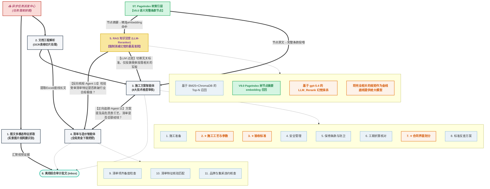

# 万科全维度工程审计系统 - 核心业务流转蓝图 (V9.0)

**此文档系工程评审最高执行标准，系统内所有智能体 (Agents) 的算力运转必须严格遵照此 DAG 推理框架执行。本版本为 V9.0 PageIndex 树索引集成版。**

## 🏗️ 核心循环审查模型 (Cyclic Cross-Check Model)

## 🧠 多智能体协同作战守则
为落实该蓝图，系统使用 `gpt-5.4` 与微型守卫编队：
1. **拦截哨兵**：(Agent 0) 预处理切片，纯无意义废话（公司简介等）直接丢弃，不消耗推理成本。
2. **方案八座守卫 (Agent 1-8)**：分别主攻质量、工期、安全等维度，任何不合格直接报红。
3. **造价三维防线 (Agent 9-11)**：基于表格强制特征审查报价明细与漏项。
4. **十字交叉刺客 (Cross-Check Agents)**：利用 `方案->清单` 的倒逼逻辑，追杀图纸提到了但不给钱的漏洞，彻底防范未报备的签证单。

## 🌳 V9.0 知识底座升维：PageIndex 树索引
5. **树索引知识节点**：国标文档不再被 OCR 按页硬切，而是由 [PageIndex](https://github.com/VectifyAI/PageIndex) 框架通过 LLM 推理提取层级目录树，每个叶节点 = 一个语义完整的条款。节点**摘要**用于 ChromaDB/BM25 精准命中，节点**原文**用于 Agent 审查投喂；若树节点缺少 LLM summary，灌入层会生成本地结构化短摘要兜底，避免 embedding 退化为长原文截断。彻底消灭"断头规范"导致的误判和幻觉。
6. **OCR 前置兜底**：PageIndex 生成前会先评估 PDF 自带文本层；若文本层为空或质量不足，则调用项目统一 `ocr_engine` 生成逐页文本（PaddleOCR 在线引擎优先，未配置时回退 RapidOCR），再把逐页文本交给 PageIndex 组织成树节点。在线 PaddleOCR 单次提交上限按 `PADDLE_MAX_PAGES_PER_REQUEST=100` 控制，超长 PDF 自动分段提交后再合并页文本。
7. **PageIndex-first 去重**：国标规范一旦完成 PageIndex 灌入，同源旧版 OCR 按页/固定切片 legacy 条目默认标记为 `inactive`，只保留审计历史，不再参与 Chroma/BM25 active 召回，避免同一 PDF 重复 OCR、重复入库、重复命中。
