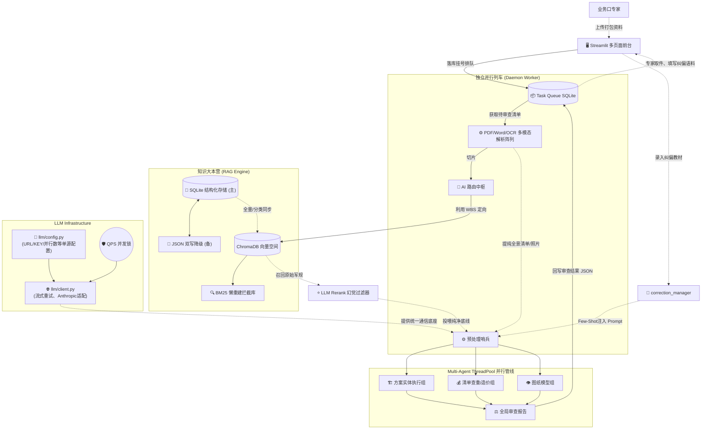

# 🏢 万科工程方案自动审核系统 (Vanke Auto Review System V9.1) - 核心架构与维护说明书

## 📖 1. 项目愿景与定位
在经历了多轮高速迭代后，本自动审查系统的核心已迈入**纯异步大队列、防崩溃重载、多源 LLM 支持、并行化推理**的工业级完全体形态。

V9.1 是在 V9.0（树索引集成）基础上的**大规模基础设施重构与性能调优版本**，解决了长尾的耦合、性能与健壮性问题，全面提升了系统的企业级可用性。

---

## 🏗️ 2. 核心架构拓扑图

系统分为四大核心引擎体系：**多页面审查前台**、**并行化后台审计列车**、**双引擎知识大本营**、**独立 LLM 通讯底座**。全部通过本地 SQLite 和异步通信隔离解耦，不畏惧任何死机闪退，且具备极强的拓展能力。

### 2.1 模块与信息流 (Architecture Diagram)


### 2.2 目录结构核心索引（V9.1 新版）
```text
auto_review_system/
├── start_all.sh                      # 【运维点火】带 Watchdog，异常崩溃每 30s 自动拉起
├── app.py                            # 【前端入口】仅包含 page_config 和首页仪表盘
├── ui_config.py                      # 【前端全局】万科红主题与 Session State 单源配置
├── pages/                            # 【多页面矩阵】业务隔离的 Streamlit 页面
│   ├── 1_🏗️_专家审阅.py             # 入舱窗口
│   ├── 2_📥_审核收发室.py           # 查看报告与专家人工纠偏台
│   └── 3_📚_知识库管理.py           # 标准录入、批量编辑、LLM 洗库
├── agent_worker.py                   # 【后台列车】无限死循环巡线，消费审查队列
│
├── llm/                              # ★ V9.1 新增：独立大模型通讯基建
│   ├── config.py                     # 全局配置中心 (优先读 .env)
│   └── client.py                     # 统一带 QPS 互斥锁、Streaming、退避重试的 HTTP 客户端
│
├── auditors/                         # 【认知中枢】AI 思考与特工组织
│   ├── engineering_auditor.py        # 纯业务逻辑 RAG/Rerank，剥离基建
│   ├── multi_agent.py                # 线性管线调度，采用 ThreadPoolExecutor 实现多特工爆发并发
│   └── agents/                       # 各类职责职能的特工集合
│
├── rag_engine/                       # 【知识大本营】RAG 大脑与突触
│   ├── kb_manager.py                 # 双写调度室 (SQLite 优先，写穿透至 JSON)
│   ├── kb_store.py                   # ★ V9.1 新增：SQLite 主基底存储（支持多维索引）
│   ├── vector_store.py               # ChromaDB 载具 + BM25 脏标记懒重建机制
│   ├── correction_manager.py         # 专家纠偏录入与 Few-shot 动态获取器
│   └── queue_manager.py              # 并发全共享缓存的连接池管理模块
│
├── parsers/                          # 【多模态器官】结构化提取器
│
└── data/                             # 【离线档案处】SQLite/ChromaDB/JSON
    ├── knowledge_base.db             # ★ V9.1 新增主库
    ├── knowledge_base.json           # 并行双写备胎
    └── correction_cases.json         # 人工喂养的降幻觉教材库
```

---

## 🔄 3. V9.1 架构飞跃：七大工业级优化指北

### 突破 1：LLM 基建剥离，插拔即用
将底层大模型网络通讯从臃肿的业务层 (`engineering_auditor.py`) 彻底抽离放到 `llm/client.py`，所有 URL、KEY 等机密数据全从 `.env` 中读取，彻底消灭硬编码。天然适配 OpenAI、Azure，甚至支持针对特定格式改造对 **Anthropic** 梯队接口。并自带**全局并发进程互斥锁 (QPS 锁)**，阻断因调用频率过高导致的账号封禁死锁。

### 突破 2：BM25 惰性脏重建机制 (Lazy Rebuild)
业务侧批量更新知识库（比如修了 50 条语病）时，以往每改一条都会触发结巴分词的全局重建。V9.1 引入脏标记 (`mark_bm25_dirty`)，更新时不计算，直到 Reranker 真正触发搜索阶段 (`retrieve_rules`) 发现带脏标记时，才进行**一次按需计算**，使单次注入/删改的速度提升数十倍。

### 突破 3：`knowledge_base.db` SQLite 数据主轴化
知识库庞大到拥有超 2000 个复杂条目，解析 7MB JSON 在 Streamlit 前端造成明显主线程卡顿。此时使用 **主读 SQLite，写同步 JSON** 的方案。对数据的操作（统计数量、分类检索）在 SQLite 层做过滤即可（响应在毫秒级），JSON 文件保留只作为紧急托底与人眼阅读查阅备库。加上 `get_all_rules()` 的文件 `mtime` 内存缓存，实现无感极速翻页。

### 突破 4：多页面 App 分形与降噪
告别冗长的包含 `if-elif` 控制分支的 500+ 行 `app.py`，按照现代化架构，将其直接分散到 `pages/` 下，实现模块独立测试运行，避免在查看审核结果的时候意外加载不需要的图纸解析组件，降低前端 OOM 概率。

### 5. Multi-Agent 线程池并发爆发
特工管线再长也不怕慢，在 `multi_agent.py` 内以任务切片为单位，引入 `ThreadPoolExecutor` 挂接 `AGENT_PARALLEL_WORKERS` 环境变量（默认 4 到 8）。现在 10 个审查项不再依次傻等网络请求，而是在同一秒钟火力全开一齐涌向 LLM 代理服务器。审查速度获得了实质性的跨越。

### 6. 日志流转替代 Print，保留罪证
完全废除所有打印函数 `print`，使用 Python `logging.handlers.RotatingFileHandler` 构建 `utils/log.py`，保证每次出入均打戳，最高日志保留三个轮回。排BUG或者查看 `agent_worker` 深夜意外退出原因时，仅需查看 `logs/vanke_audit.log` 即可了然于胸。

### 7. 永不宕机：Bash Watchdog 无人值守
修改 `start_all.sh` 加入类似于 Supervisor 的进程探测 `while` 循环：每 30 秒监听一遍前端、工人、API 是否在健康状态，如果谁在午夜时分因内存突增 OOM 黑屏，看门狗将在下一个探针区间直接重新 `nohup` 唤醒该服务。确保整个审核矩阵的连续作战能力。

---

## 👩‍🔧 4. 人机协同演进：幻觉纠偏录入系统

V9.1 提供了一条让大模型**每天变聪明的回路**。专家在【审核收发室】领取 AI 生成的 Word 报告时，会在下方发现**“❌ 误判标记台”**。

当发现 AI 比如把**“地下排风”**规范硬套在**“屋顶防雷”**图纸上时，专家就在这输入：*“错误匹配盲点！由于地下室防水要求不适用于高空设备层，这里应当判定合规。”*

这行文字会直接存入 `correction_cases.json`，在日后任何类似项目发起审核时，系统将通过 `correction_manager.py` 悄悄将其化为 Few-Shot Prompt，注入给当前工作的特工，强行纠正其世界观。
真正实现：错一次，企业内系统再不犯同样的错。
